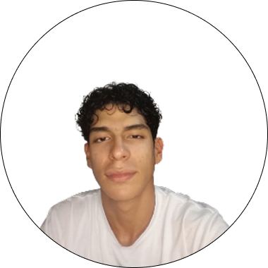

# 👨‍💻 ¡Hola mi nombre es Juanda!

    
    

  

**Soy un desarrollador web apasionado del desarrollo y arquitectura web con experiencia en la creación de soluciones digitales innovadoras. Especializado en diseñar aplicaciones web escalables y landing pages      de alto impacto orientadas a resolver desafíos empresariales y potenciar la presencia digital de marcas y clientes.**

    
<strong>📊 Github stats</strong>

    

## Skills

